# PTK (Linux) 설치 가이드

이 문서는 SafeNet PTK(Protect Toolkit) 7.3.1 Linux 클라이언트 설치 및 기본 설정 방법을 설명합니다.

## 1. 압축 해제
```sh
tar -xvf 610-009981-032_SW_PTK_7.3.1_Client_RevA.tar
cd 610-009981-032_SW_PTK_7.3.1_Client_RevA/SDKs/Linux64/
```

## 2. 설치 실행
```sh
sudo ./safeNet-install.sh
```
설치 중 안내에 따라 Y를 눌러 진행합니다.


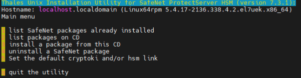

설치 항목 선택 화면에서 3번(설치할 프로그램 확인)을 선택합니다.

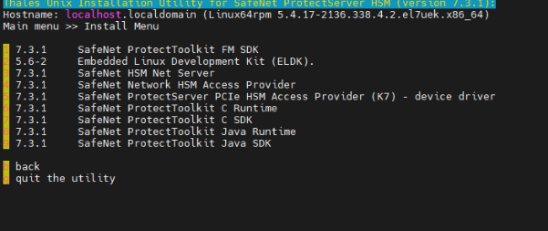

설치 순서 권장: 4번(HSM Access Provider) → 6, 7, 8, 9 번 순으로 설치하세요.

설치 후 뒤로 나오려면 `b` 를 누릅니다.

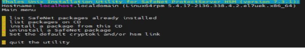

설정창에서 5번( Cryptoki Provider 설정)을 확인합니다.

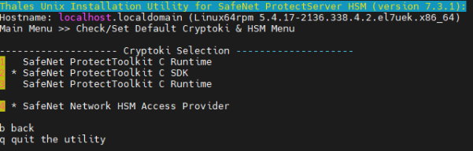

> 참고
> - PSE 에뮬레이터 모드: SDK를 디폴트로 설정하세요.
> - 물리적 PSE 장비 연결: C Runtime을 디폴트로 설정하세요.

## 3. 환경변수 설정
홈 디렉터리의 bash_profile에 다음을 추가합니다:
```sh
# ~/.bash_profile
source /opt/safenet/protecttoolkit7/cpsdk/setvars.sh
```

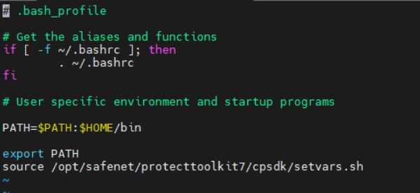

## 4. 물리적 장비 연결 시 (선택)
/etc/default 디렉터리로 이동하여 `et_hsm` 파일에 PSE 장비의 IP를 입력합니다.

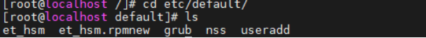

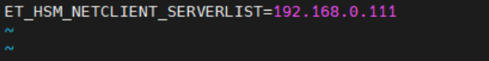

`ctconf -v` 로 정상 호출 확인:
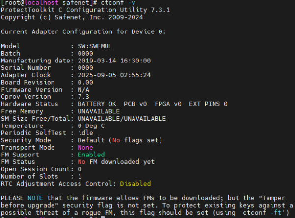

## 5. 슬롯 초기화 및 키 관리
`gctadmin` 실행 후 슬롯 초기화를 진행합니다.
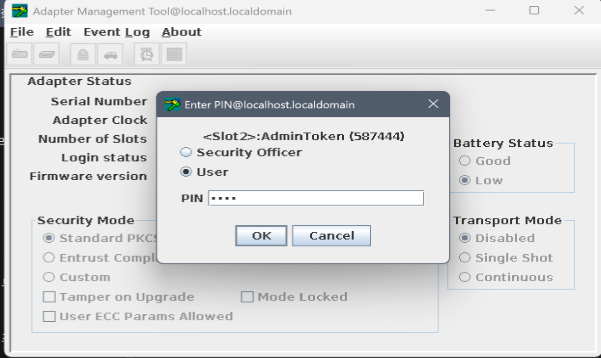

슬롯 초기화 예:
```sh
ctkmu t -s <슬롯넘버> -l <label>
```
초기화 전후 객체 조회 예:
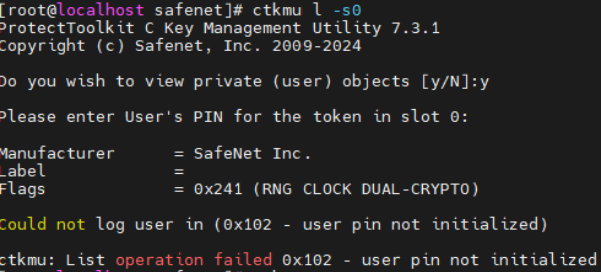
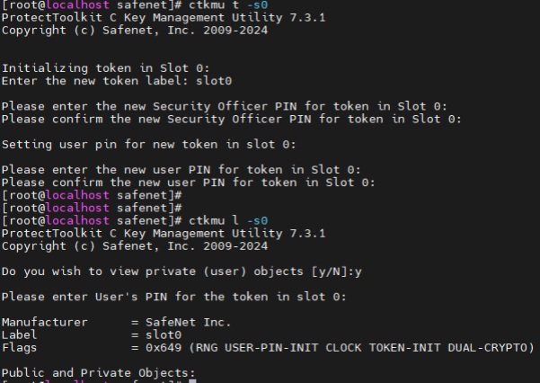

### 키 생성
kmu 또는 ctkmu 명령으로 키를 생성합니다.
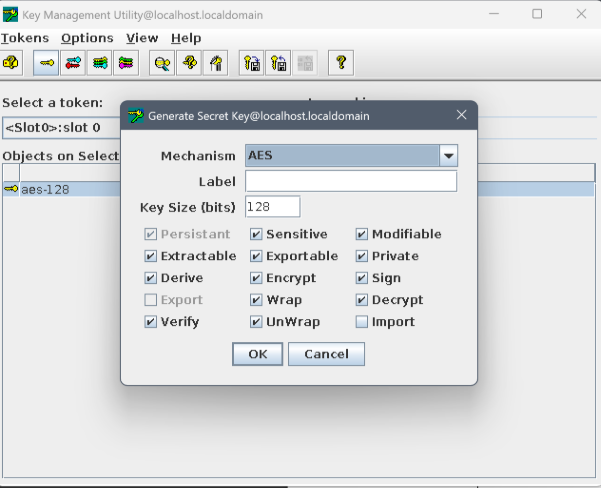

ctkmu 예:
```sh
ctkmu c -t <key_type> -n <label> -a <attributes> -s <slot>
```
옵션 설명:
- -t: 키 타입 (필수)
- -n: 키 이름(label), 예: myAESKey
- -a: 속성 (E,D,S,V,W,U,R,M 등) 예: -a ED
- -s: 슬롯 지정


### 키 조회
```sh
ctkmu l -s <slot>
kmu
```

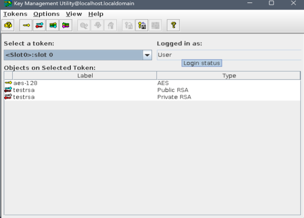

슬롯을 지정하여 유저 PIN으로 로그인한 후 필요한 작업을 진행하세요.
