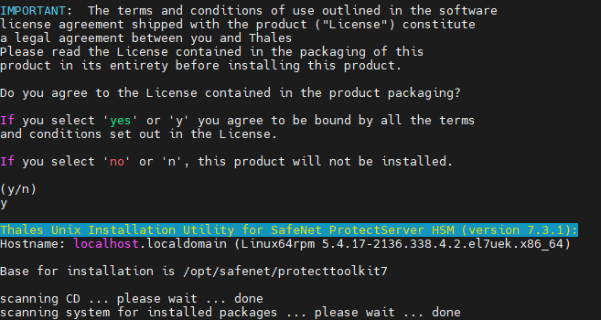
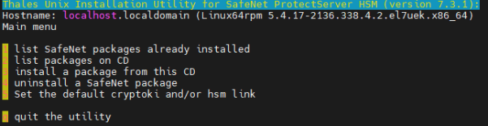
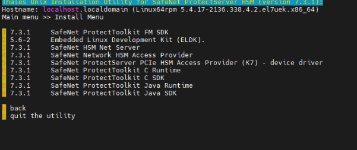
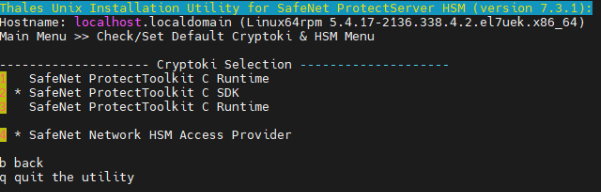
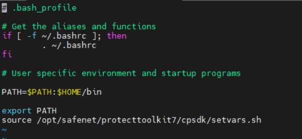
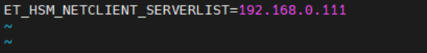
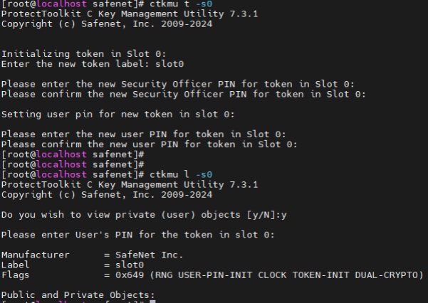
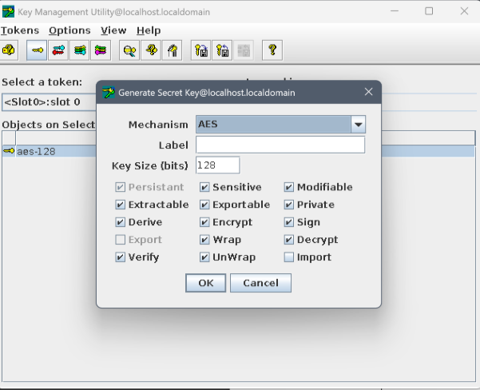
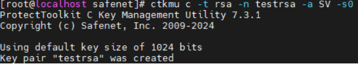
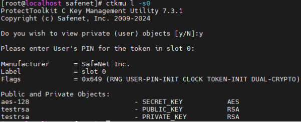

#PTK(Linux) 설치하기

1. PTK(tar) 파일 압축해제하기

tar -xvf 610-009981-032\_SW\_PTK\_7.3.1\_Client\_RevA.tar

1. 디렉토리 이동

cd 610-009981-032\_SW\_PTK\_7.3.1\_Client\_RevA/SDKs/Linux64/

1. PTK 설치파일 실행

[root@localhost Linux64]# ./safeNet-install.sh

Y를 눌러서 install 실행

→ 실행후 출력물

1. 이후 3번을 눌러 설치할 프로그램들을 확인 및 선택

1. 프로그램 다운로드 순서는 4번(HSM Access Provider), 6번,7번,8번,9번 순서로 설치
1. 설치 후 b를 눌러 뒤로 나오기\
   \
   (뒤로 나온 후 화면)
1. 설정창 5번 선택 후 Cryptoki Provider 설정 확

\*\*PSE의 에뮬레이터 모드를 실행하려면 SDK 를 디폴트로 설정해야함\*\*

\*\*PSE 장비와 물리적으로 연결하기 위해서는 C Rumtime을 디폴트로 설정해야함\*\*

1. 환경변수 설정

-vi ~/.bash\_profile

source /opt/safenet/protecttoolkit7/cpsdk/setvars.sh 입력후 저장

1. \*\*장비에 물리적으로 연결할 경우\*\*

\- 디렉토리 이동 cd /etc/default

Vi et\_hsm 으로 PSE에 설정된 ip 값 입력

1. ctconf -v 정상적으로 호출되는지 확인

1. gctadmin 입력 후 slot initializing 진행

1. ctkmu t -s<슬롯넘버> -l<label> 명령어로 slot initializing 진행

(이니셜라이징 하기 전 ctkmu l 명령어로 기존 오브젝트들을 조회한 결과)

(ctkmu t -s<슬롯넘버> -l<label> 명령어로 이니셜라이징 후 ctkmu l 로 슬롯 오브젝트를 조회하였을 때 캡쳐본)

1. 오브젝트(키) 생성
   1. 키 생성(kmu)

1. 키 생성(ctkmu c)

Ex) ctkmu c -t <key\_type> -n <label> -a <attribute> -s<슬롯지정>

-t : **키 타입 지정** (필수)

-n : **키 이름(label)** → 이걸로 나중에 찾을 수 있음.\
예: -n myAESKey

-a : **속성(attributes)** → 키 권한을 정함.

- E (Encrypt), D (Decrypt), S (Sign), V (Verify),
- W (Wrap), U (Unwrap), R (Derive), M (Modifiable) 등\
  예: -a ED → Encrypt/Decrypt 가능 키

-s : 특정 슬롯 지정 (여러 슬롯 있는 경우)

1. 오브젝트(키) 조회하기
   1. 오브젝트 조회(ctkmu l -s<슬롯지정>)

1. 오브젝트 조회(kmu)

슬롯 지정하여 유저핀으로 로그인 후 화면
